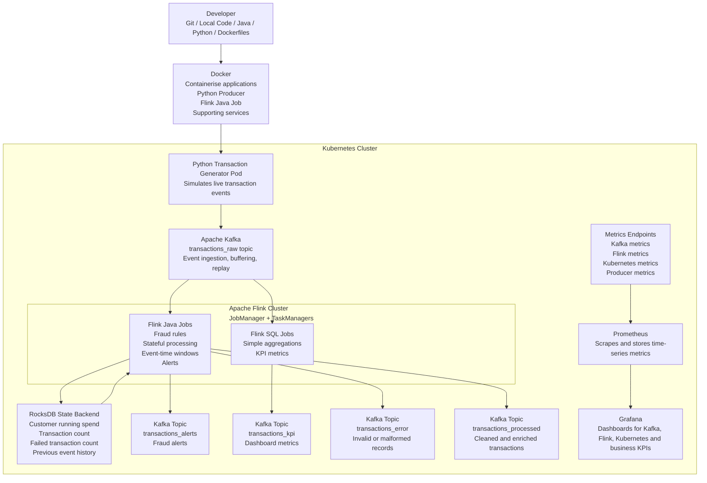
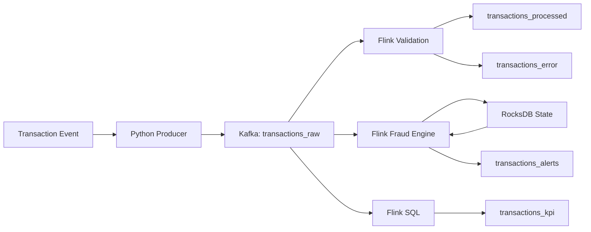

# Architecture

## Overview

The Enterprise Real-Time Transaction Streaming Platform is designed to simulate how banks, fintechs, payment companies, and large technology companies build real-time streaming systems.

The platform generates financial transaction events, streams them through Kafka, processes them with Flink, stores state using RocksDB, emits processed events and alerts back to Kafka, and exposes operational metrics through Prometheus and Grafana.

## Final Architecture



## Architecture Summary

```text
Python Transaction Generator
        ↓
Docker Container
        ↓
Kubernetes Pod
        ↓
Kafka Topic: transactions_raw
        ↓
Flink Java / Flink SQL
        ↓
RocksDB State Backend
        ↓
Kafka Output Topics
        ↓
Prometheus Metrics
        ↓
Grafana Dashboard
```

## Component Responsibilities

| Component | Responsibility |
|----------|----------------|
| Python Producer | Generate realistic simulated financial transaction events |
| Docker | Package applications and supporting services |
| Kafka | Ingest, buffer, retain and replay transaction events |
| Flink Java | Perform production-style stateful stream processing and fraud detection |
| Flink SQL | Produce simple real-time analytics and KPI aggregations |
| RocksDB | Store local state for customer-level fraud rules |
| Prometheus | Collect operational and application metrics |
| Grafana | Visualise infrastructure and business metrics |
| Docker Compose | Run the full platform locally |
| Kubernetes | Run the platform in a production-like environment |
| Helm | Install and manage Kubernetes applications |
| Strimzi | Manage Kafka on Kubernetes |
| Flink Kubernetes Operator | Manage Flink jobs on Kubernetes |

## Data Flow



## Local Architecture

The local environment will use Docker Compose.

```text
Docker Compose

├── Kafka
├── Kafka UI
├── Flink JobManager
├── Flink TaskManager
├── Python Producer
├── Prometheus
└── Grafana
```

## Kubernetes Architecture

```text
Kubernetes Cluster

├── Namespace: streaming
│   ├── Python Producer Deployment
│   ├── Kafka Cluster
│   ├── Flink JobManager
│   ├── Flink TaskManagers
│   └── Kafka Topics
│
└── Namespace: monitoring
    ├── Prometheus
    └── Grafana
```

## Operator-Based Architecture

```text
Kubernetes

├── Strimzi Operator
│   └── Kafka Cluster
│       ├── transactions_raw
│       ├── transactions_processed
│       ├── transactions_alerts
│       ├── transactions_kpi
│       └── transactions_error
│
└── Flink Kubernetes Operator
    └── Flink Fraud Detection Job
```

## Design Principles

- Build incrementally.
- Introduce each technology only when needed.
- Prefer working systems over isolated learning.
- Keep each phase testable.
- Preserve replayability through Kafka.
- Use stateful processing only where business logic requires memory.
- Observe both system metrics and business metrics.