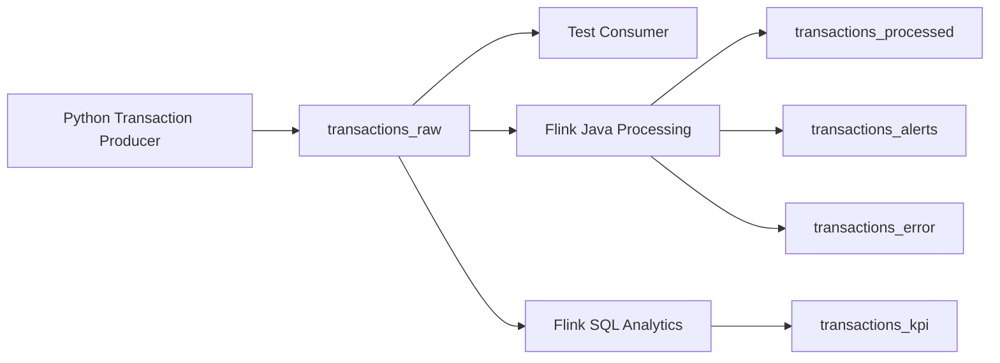

# Kafka

## Purpose

Apache Kafka is the messaging layer for the platform. It ingests simulated financial transaction events, stores them in topics, allows replay from offsets, and decouples producers from downstream Flink processing jobs.

## Core Concepts to Learn

- Broker
- Topic
- Producer
- Consumer
- Consumer group
- Partition
- Offset
- Retention
- Replay

## Kafka Flow



## Final Kafka Topics

| Topic | Purpose |
|-------|---------|
| transactions_raw | Raw transaction events from Python producer |
| transactions_processed | Cleaned and enriched transactions |
| transactions_alerts | Fraud and anomaly alerts |
| transactions_kpi | Aggregated metrics for dashboarding |
| transactions_error | Invalid or malformed records |

## Topic: transactions_raw

This is the primary ingestion topic.

It receives simulated financial transaction events from the Python producer.

Example event:

```json
{
  "transaction_id": "TX100001",
  "customer_id": "CUST001",
  "account_id": "ACC001",
  "merchant_id": "MRC001",
  "merchant_category": "Electronics",
  "amount": 350.50,
  "currency": "SGD",
  "country": "SG",
  "channel": "Online",
  "status": "SUCCESS",
  "event_time": "2026-07-06T10:20:15"
}
```

## Topic: transactions_processed

This topic stores cleaned and enriched transaction events.

Produced by:

- Flink validation logic
- Flink Java processing job

Used by:

- Downstream analytics
- Testing
- Reprocessing
- Operational review

## Topic: transactions_alerts

This topic stores fraud and anomaly alerts generated by the Flink fraud engine.

Example event:

```json
{
  "alert_id": "ALERT100001",
  "customer_id": "CUST001",
  "transaction_id": "TX100001",
  "alert_type": "HIGH_VELOCITY_SPEND",
  "severity": "HIGH",
  "description": "Customer spent more than SGD 10,000 within 5 minutes",
  "event_time": "2026-07-06T10:25:15"
}
```

## Topic: transactions_kpi

This topic stores real-time KPI metrics generated by Flink SQL.

Example metrics:

- Transaction volume per minute
- Total transaction amount per minute
- Average transaction size
- Top merchant categories
- Failed transaction rate
- Alert count per minute

## Topic: transactions_error

This is the Dead Letter Queue topic.

Events should be routed here if:

- Required fields are missing
- Amount is invalid
- Currency is missing
- Event time cannot be parsed
- JSON structure is invalid

## Producer Design

The Python producer should eventually:

- Generate realistic transaction events
- Support configurable event rate
- Support normal and suspicious scenarios
- Write events to `transactions_raw`
- Log sent events
- Expose producer metrics where possible

## Consumer Design

Test consumers should be used to validate:

- Events are being produced
- Topic messages are readable
- Offsets are progressing
- Invalid messages can be inspected
- Replay works from earlier offsets

## Topic Design Notes

Initial local development can use simple settings.

As the project matures, improve topic design with:

- More partitions
- Longer retention
- Clear naming conventions
- Schema validation
- Avro or Protobuf
- Schema Registry
- Replay testing

## Recommended Initial Topics

```text
transactions_raw
transactions_processed
transactions_alerts
transactions_kpi
transactions_error
```

## Future Enhancements

- Schema Registry
- Avro serialization
- Protobuf serialization
- Multiple producer instances
- Multiple consumer groups
- Exactly-once processing
- Replay from Kafka offsets
- Load testing