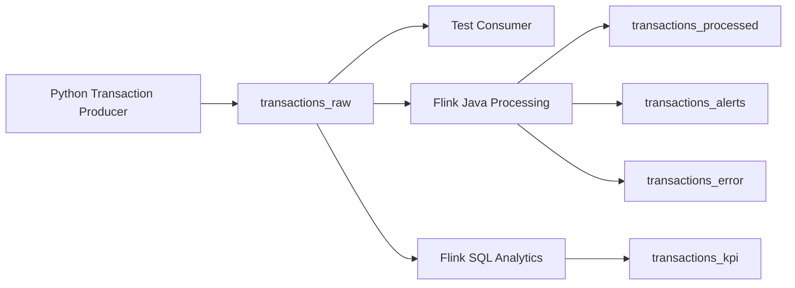

# Kafka

## Purpose

Apache Kafka is the messaging layer for the platform. It ingests simulated financial transaction events, stores them in topics, allows replay from offsets, and decouples producers from downstream Flink processing jobs.

For this project, Kafka should be run locally in **KRaft mode** rather than ZooKeeper mode. That keeps the initial setup smaller and matches the modern Kafka direction.

## Core Concepts to Learn

- Broker
- Topic
- Producer
- Consumer
- Consumer group
- Partition
- Offset
- Retention
- Replay

## Kafka Flow



## Local Kafka Setup

Use a single Kafka broker in KRaft mode for the first implementation.

Recommended local shape:

- one Kafka broker
- no ZooKeeper
- one application topic: `transactions_raw`
- optional Kafka UI for inspection

The first verification target has now been completed:

```text
Python producer -> transactions_raw -> consumer check
```

## Final Kafka Topics

| Topic | Purpose |
|-------|---------|
| transactions_raw | Raw transaction events from Python producer |
| transactions_processed | Cleaned and enriched transactions |
| transactions_alerts | Fraud and anomaly alerts |
| transactions_kpi | Aggregated metrics for dashboarding |
| transactions_error | Invalid or malformed records |

## Topic: transactions_raw

This is the primary ingestion topic.

It receives simulated financial transaction events from the Python producer without requiring changes to the producer's transaction model or generator logic.

Example event:

```json
{
  "transaction_id": "TX100001",
  "customer_id": "CUST001",
  "account_id": "ACC001",
  "merchant_id": "MRC001",
  "merchant_category": "Electronics",
  "amount": 350.50,
  "currency": "SGD",
  "country": "SG",
  "channel": "Online",
  "status": "SUCCESS",
  "event_time": "2026-07-06T10:20:15"
}
```

## Topic: transactions_processed

This topic stores cleaned and enriched transaction events.

Produced by:

- Flink validation logic
- Flink Java processing job

Used by:

- Downstream analytics
- Testing
- Reprocessing
- Operational review

## Topic: transactions_alerts

This topic stores fraud and anomaly alerts generated by the Flink fraud engine.

Example event:

```json
{
  "alert_id": "ALERT100001",
  "customer_id": "CUST001",
  "transaction_id": "TX100001",
  "alert_type": "HIGH_VELOCITY_SPEND",
  "severity": "HIGH",
  "description": "Customer spent more than SGD 10,000 within 5 minutes",
  "event_time": "2026-07-06T10:25:15"
}
```

## Topic: transactions_kpi

This topic stores real-time KPI metrics generated by Flink SQL.

Example metrics:

- Transaction volume per minute
- Total transaction amount per minute
- Average transaction size
- Top merchant categories
- Failed transaction rate
- Alert count per minute

## Topic: transactions_error

This is the Dead Letter Queue topic.

Events should be routed here if:

- Required fields are missing
- Amount is invalid
- Currency is missing
- Event time cannot be parsed
- JSON structure is invalid

## Producer Design

The existing Python producer should be able to:

- Generate realistic transaction events
- Keep its current `Transaction` model and generator behavior
- Write events to `transactions_raw`
- Log sent events

Kafka-specific concerns should stay outside the core generator code where possible. Prefer adding a small Kafka publishing layer or adapter rather than reshaping the working producer internals.

## Consumer Design

Test consumers should be used to validate:

- Events are being produced
- Topic messages are readable
- Offsets are progressing
- Invalid messages can be inspected
- Replay works from earlier offsets

## Topic Design Notes

Initial local development can use simple settings.

As the project matures, improve topic design with:

- More partitions
- Longer retention
- Clear naming conventions
- Schema validation
- Avro or Protobuf
- Schema Registry
- Replay testing

## Recommendation For This Repo

For the current `v0.3.0` milestone:

- use KRaft
- keep the producer code stable
- add Kafka publishing around the existing transaction output
- verify delivery with a consumer before moving on to Flink

The producer-to-`transactions_raw` path has now been implemented and locally verified, so the Kafka milestone can be treated as complete for this phase of the project.

## Where RocksDB Fits

RocksDB is not part of the Kafka broker or the Kafka producer milestone.

Kafka stores event logs in topics so downstream systems can consume and replay events. RocksDB will be introduced later as the Flink state backend for customer-level fraud detection logic.

Use RocksDB when the platform needs memory across multiple events, such as:

- rolling customer spend over a time window
- repeated failed transaction counts
- transaction velocity per customer
- previous transaction country
- historical average transaction amount

The first Kafka milestone should stay focused on this flow:

```text
Python producer -> transactions_raw -> consumer check
```

## Recommended Initial Topics

```text
transactions_raw
transactions_processed
transactions_alerts
transactions_kpi
transactions_error
```

## Future Enhancements

- Schema Registry
- Avro serialization
- Protobuf serialization
- Multiple producer instances
- Multiple consumer groups
- Exactly-once processing
- Replay from Kafka offsets
- Load testing

## Kafka Learning

### Setup and Controllers

For setup with **KRaft**:
- Need to define brokers and controllers
- A node can be both a broker and a controller

For small clusters:
- Every broker is both a broker and controller

```properties
process.roles=broker,controller
```

```text
Broker1
Broker + Controller

Broker2
Broker + Controller

Broker3
Broker + Controller

```

Although all 3 are capable of being controllers, only one is elected as active controller at a time. The others
are standby controllers.

For large production clusters:

```text

Controller 1
Controller 2
Controller 3

Broker 1
Broker 2
Broker 3
Broker 4
Broker 5
Broker 6
```

Controllers manage metadata only, and brokers only store messages, reducing load on brokers.

Suppose:

```text

Broker1
Broker2
Broker3

Active Controller = Broker2
```

If Broker2 crashes, the reamining controller-capable brokers elect a new active controller.

### Docker Setup

```yaml

services:
  init-permissions:
    image: apache/kafka:latest
    container_name: init-permissions
    user: root
    command: ["bash", "-lc", "chown -R 1000:1000 /tmp/kraft-combined-logs"]
    volumes:
      - broker-data:/tmp/kraft-combined-logs
    restart: "no"


  broker:
    image: apache/kafka:latest
    hostname: broker
    container_name: broker
    depends_on:
      init-permissions:
        condition: service_completed_successfully
    ports:
      - "9092:9092"
    environment:
      KAFKA_NODE_ID: 1
      KAFKA_PROCESS_ROLES: broker,controller
      CLUSTER_ID: MkU3OEVBNTcwNTJENDM2Qk
      KAFKA_CONTROLLER_QUORUM_VOTERS: 1@broker:29093
      KAFKA_OFFSETS_TOPIC_REPLICATION_FACTOR: 1

      KAFKA_LISTENERS: PLAINTEXT://broker:29092,CONTROLLER://broker:29093,PLAINTEXT_HOST://0.0.0.0:9092
      KAFKA_ADVERTISED_LISTENERS: PLAINTEXT://broker:29092,PLAINTEXT_HOST://localhost:9092
      KAFKA_CONTROLLER_LISTENER_NAMES: CONTROLLER

      KAFKA_LOG_DIRS: /tmp/kraft-combined-logs

      KAFKA_LISTENER_SECURITY_PROTOCOL_MAP: PLAINTEXT:PLAINTEXT,PLAINTEXT_HOST:PLAINTEXT,CONTROLLER:PLAINTEXT
      KAFKA_INTER_BROKER_LISTENER_NAME: PLAINTEXT
      KAFKA_TRANSACTION_STATE_LOG_REPLICATION_FACTOR: 1
      KAFKA_TRANSACTION_STATE_LOG_MIN_ISR: 1
      KAFKA_GROUP_INITIAL_REBALANCE_DELAY_MS: 0
    volumes:
      - broker-data:/tmp/kraft-combined-logs

```

### Topics and Partitions

A **topic** is where producers publish events. A topic is append-only: Kafka writes new records to the end of the log instead of changing existing records.

Topics can have zero, one, or many producers and consumers. Independent consumer groups can read the same topic at the same time without interfering with each other.

Topics are durable and retain data for a configurable amount of time, such as 7 days, even after records have been consumed.

```bash

kafka-topics.sh \
  --bootstrap-server localhost:9092 \
  --create \
  --topic transactions_raw \
  --partitions 6 \
  --replication-factor 3
```

A **partition** is an ordered shard of a topic. Partitions follow a leader/follower structure: producers write to partition leaders, and follower replicas copy records from those leaders.

For a replication factor of 3, each partition looks like this:

```text
Partition 0
├── Leader
├── Follower
└── Follower

Partition 1
├── Leader
├── Follower
└── Follower
```

The partitions are distributed across brokers like this for a 3-broker cluster, 2 topics, 6 partitions per topic, and replication factor 3:

```text

Kafka Cluster
==========================================================

Broker 1
----------------------------------------------------------
Topic: transactions_raw
P0 Leader       P1 Follower     P2 Follower
P3 Leader       P4 Follower     P5 Follower

Topic: invoice_raw
P0 Follower     P1 Leader       P2 Follower
P3 Follower     P4 Leader       P5 Follower


Broker 2
----------------------------------------------------------
Topic: transactions_raw
P0 Follower     P1 Leader       P2 Follower
P3 Follower     P4 Leader       P5 Follower

Topic: invoice_raw
P0 Follower     P1 Follower     P2 Leader
P3 Follower     P4 Follower     P5 Leader


Broker 3
----------------------------------------------------------
Topic: transactions_raw
P0 Follower     P1 Follower     P2 Leader
P3 Follower     P4 Follower     P5 Leader

Topic: invoice_raw
P0 Leader       P1 Follower     P2 Follower
P3 Leader       P4 Follower     P5 Follower

```

Leader partitions are evenly distributed across brokers. Even if a broker is done processing their leader partitions,
they will not process follower nodes as follower nodes should be replicate only.

Kafka also guarantees ordering within a partition, but not across partitions.

### Partition Keys

If

```text

key = customer_id

```

and Kafka computes

```text

hash(customer_id)
->
Partition 3

```

All transactions for the same customer will always go to the same partition.

This preserves ordering for that key.

### Offsets

Within each partition, a sequential offset is assigned to every message. This offset index is specific within a partition.

```text

Partition 0

Offset
0   Transaction A
1   Transaction B
2   Transaction C
3   Transaction D
4   Transaction E

```

Consumers read by offset, not by event ID.

### Consumer Lag

```text
transactions_raw

Partition 0

Offset
------------------------
0    transaction A
1    transaction B
2    transaction C
3    transaction D
4    transaction E
5    transaction F
6    transaction G
7    transaction H
```

Suppose transactions_raw topic has one partition.

The latest offset is = 7

If consumer has only processed up to Offset = 4,

Consumer lag = Latest offset - Consumer Offset
             = 7 - 4
             = 3

The consumer periodically commits its current offset.

Kafka stores two independent numbers, its Latest Offset and Consumer Offset.

Lag might increase because
1. Consumer is too slow
2. Producer spike, i.e suddenly there are too many transaction events and consumer cannot keep up
3. Service downstream from consumer is slow i.e consumer writes to DB, but has to wait for DB response
4. Consumer crashes, but producer keeps publishing

Lag is shown by partition, since the offset is relative to the partition.

## Kafka Producer Client

```python
from confluent_kafka import Producer

class KafkaPublisher:
    def __init__(self, bootstrap_servers: str, topic: str):
        self.topic = topic
        self.producer = Producer({
            "bootstrap.servers": bootstrap_servers,
            "acks": "all",
            "enable.idempotence": True, # more useful for when I replicate cluster

            "batch.num.messages": 10, # for Java Producer, user batch.size
            "linger.ms": 5,
        })

    def publish(self, value:str, key: str | None = None) -> None:
        self.producer.produce(
            topic = self.topic,
            value = value,
            key = key,
        )
        self.producer.poll(0)

    def flush(self) -> None:
        self.producer.flush()
```

### Idempotence

If a network timeout occurs after the producer has sent `Invoice123`, the producer may retry the publish. Without idempotence, Kafka could receive duplicate copies of `Invoice123`.

With:

```properties
enable.idempotence=true
```

The Kafka producer client assigns sequence numbers to records. The broker can then recognize a retried record it has already accepted and ignore the duplicate.

### Producer Buffer and Batching (Kafka Producer Client)

By configuring producer batching settings such as:

```properties
batch.size=65536
batch.num.messages=10
linger.ms=5
```

the Kafka producer client can wait briefly to collect more records into a batch before sending them. If the batch fills first, it sends immediately.

For this project, the Python producer uses `confluent-kafka`, which exposes librdkafka settings such as `linger.ms`, `batch.num.messages`, and `batch.size`.

### Producer Client Acknowledgement

When the producer client sends a produce request to the Kafka partition leader, the leader writes the record to its log. If replication is configured, followers copy the record from the leader. Kafka then determines whether the acknowledgement conditions are met.

```text

acks = 0

# Producer Client does not wait for confirmation.

acks = 1

# Producer Client waits for the leader to write the record.

acks = all

# Producer Client waits for all in-sync replicas required by the topic configuration.

```

The leader broker sends ACK to Producer Client, which can then take that acknowledgement status of "event received".

### Consumer Group Scaling

Instead of having only one consumer reading from a topic, multiple consumers in the same consumer group can share the work. Kafka assigns partitions to consumers, so each partition is read by only one consumer within that group at a time.

```text

Partition0 -> Consumer1
Partition1 -> Consumer2
Partition2 -> Consumer3
Partition3 -> Consumer1
Partition4 -> Consumer2
Partition5 -> Consumer3

```

### Using kafka-console-consumer

`kafka-console-consumer.sh` is useful for checking that records are arriving in a topic and for practising consumer group behaviour.

When running the command inside the Kafka broker container, use the internal Docker listener:

```bash
/opt/kafka/bin/kafka-console-consumer.sh \
  --bootstrap-server broker:29092 \
  --topic transactions_raw
```

Read retained records from the beginning of the topic:

```bash
/opt/kafka/bin/kafka-console-consumer.sh \
  --bootstrap-server broker:29092 \
  --topic transactions_raw \
  --from-beginning
```

Use a named consumer group so Kafka stores committed offsets for that group:

```bash
/opt/kafka/bin/kafka-console-consumer.sh \
  --bootstrap-server broker:29092 \
  --topic transactions_raw \
  --group transaction-debugger
```

Read from the beginning with a named group. This only starts from the beginning if the group does not already have committed offsets:

```bash
/opt/kafka/bin/kafka-console-consumer.sh \
  --bootstrap-server broker:29092 \
  --topic transactions_raw \
  --group transaction-debugger \
  --from-beginning
```

Useful flags:

| Flag | Meaning |
|------|---------|
| `--bootstrap-server` | Kafka broker address used by the consumer |
| `--topic` | Topic to read records from |
| `--from-beginning` | Start at the earliest retained records if no committed offset exists |
| `--group` | Consumer group ID used for offset tracking |

For this local Docker Compose setup:

- Use `broker:29092` from inside Docker containers on the Compose network.
- Use `localhost:9092` from the host machine.
