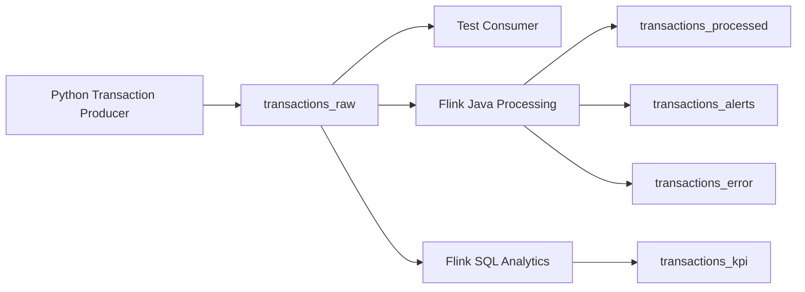

# Kafka

## Purpose

Apache Kafka is the messaging layer for the platform. It ingests simulated financial transaction events, stores them in topics, allows replay from offsets, and decouples producers from downstream Flink processing jobs.

For this project, Kafka should be run locally in **KRaft mode** rather than ZooKeeper mode. That keeps the initial setup smaller and matches the modern Kafka direction.

## Core Concepts to Learn

- Broker
- Topic
- Producer
- Consumer
- Consumer group
- Partition
- Offset
- Retention
- Replay

## Kafka Flow



## Local Kafka Setup

Use a single Kafka broker in KRaft mode for the first implementation.

Recommended local shape:

- one Kafka broker
- no ZooKeeper
- one application topic: `transactions_raw`
- optional Kafka UI for inspection

The first verification target is simple:

```text
Python producer -> transactions_raw -> consumer check
```

## Final Kafka Topics

| Topic | Purpose |
|-------|---------|
| transactions_raw | Raw transaction events from Python producer |
| transactions_processed | Cleaned and enriched transactions |
| transactions_alerts | Fraud and anomaly alerts |
| transactions_kpi | Aggregated metrics for dashboarding |
| transactions_error | Invalid or malformed records |

## Topic: transactions_raw

This is the primary ingestion topic.

It receives simulated financial transaction events from the Python producer without requiring changes to the producer's transaction model or generator logic.

Example event:

```json
{
  "transaction_id": "TX100001",
  "customer_id": "CUST001",
  "account_id": "ACC001",
  "merchant_id": "MRC001",
  "merchant_category": "Electronics",
  "amount": 350.50,
  "currency": "SGD",
  "country": "SG",
  "channel": "Online",
  "status": "SUCCESS",
  "event_time": "2026-07-06T10:20:15"
}
```

## Topic: transactions_processed

This topic stores cleaned and enriched transaction events.

Produced by:

- Flink validation logic
- Flink Java processing job

Used by:

- Downstream analytics
- Testing
- Reprocessing
- Operational review

## Topic: transactions_alerts

This topic stores fraud and anomaly alerts generated by the Flink fraud engine.

Example event:

```json
{
  "alert_id": "ALERT100001",
  "customer_id": "CUST001",
  "transaction_id": "TX100001",
  "alert_type": "HIGH_VELOCITY_SPEND",
  "severity": "HIGH",
  "description": "Customer spent more than SGD 10,000 within 5 minutes",
  "event_time": "2026-07-06T10:25:15"
}
```

## Topic: transactions_kpi

This topic stores real-time KPI metrics generated by Flink SQL.

Example metrics:

- Transaction volume per minute
- Total transaction amount per minute
- Average transaction size
- Top merchant categories
- Failed transaction rate
- Alert count per minute

## Topic: transactions_error

This is the Dead Letter Queue topic.

Events should be routed here if:

- Required fields are missing
- Amount is invalid
- Currency is missing
- Event time cannot be parsed
- JSON structure is invalid

## Producer Design

The existing Python producer should be able to:

- Generate realistic transaction events
- Keep its current `Transaction` model and generator behavior
- Write events to `transactions_raw`
- Log sent events

Kafka-specific concerns should stay outside the core generator code where possible. Prefer adding a small Kafka publishing layer or adapter rather than reshaping the working producer internals.

## Consumer Design

Test consumers should be used to validate:

- Events are being produced
- Topic messages are readable
- Offsets are progressing
- Invalid messages can be inspected
- Replay works from earlier offsets

## Topic Design Notes

Initial local development can use simple settings.

As the project matures, improve topic design with:

- More partitions
- Longer retention
- Clear naming conventions
- Schema validation
- Avro or Protobuf
- Schema Registry
- Replay testing

## Recommendation For This Repo

For the current `v0.3.0` milestone:

- use KRaft
- keep the producer code stable
- add Kafka publishing around the existing transaction output
- verify delivery with a consumer before moving on to Flink

## Where RocksDB Fits

RocksDB is not part of the Kafka broker or the Kafka producer milestone.

Kafka stores event logs in topics so downstream systems can consume and replay events. RocksDB will be introduced later as the Flink state backend for customer-level fraud detection logic.

Use RocksDB when the platform needs memory across multiple events, such as:

- rolling customer spend over a time window
- repeated failed transaction counts
- transaction velocity per customer
- previous transaction country
- historical average transaction amount

The first Kafka milestone should stay focused on this flow:

```text
Python producer -> transactions_raw -> consumer check
```

## Recommended Initial Topics

```text
transactions_raw
transactions_processed
transactions_alerts
transactions_kpi
transactions_error
```

## Future Enhancements

- Schema Registry
- Avro serialization
- Protobuf serialization
- Multiple producer instances
- Multiple consumer groups
- Exactly-once processing
- Replay from Kafka offsets
- Load testing
